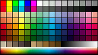



## A Drawer : All about the paint program codes\!

### Description

You can get many kinds of codes about paint applications like pencil tool, line,

eraser, picker, gradation, open files, and more. You can configure options. And more!

You can also get filters! Enjoy it!
 
### More Info
 

             |
---                |---
**Submitted On**   |1999-10-17 19:42:10
**By**             |[Jongmin Baek](https://github.com/Planet-Source-Code/PSCIndex/blob/master/ByAuthor/jongmin-baek.md)
**Level**          |Unknown
**User Rating**    |4.9 (39 globes from 8 users)
**Compatibility**  |VB 5\.0, VB 6\.0
**Category**       |[Complete Applications](https://github.com/Planet-Source-Code/PSCIndex/blob/master/ByCategory/complete-applications__1-27.md)
**World**          |[Visual Basic](https://github.com/Planet-Source-Code/PSCIndex/blob/master/ByWorld/visual-basic.md)
**Archive File**   |[CODE\_UPLOAD1327\.zip](https://github.com/Planet-Source-Code/jongmin-baek-a-drawer-all-about-the-paint-program-codes__1-4079/archive/master.zip)

